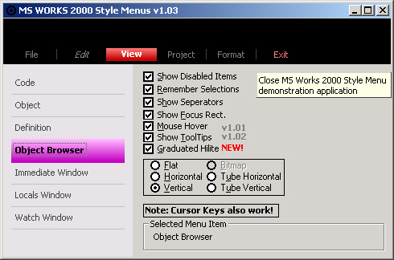



## MS Works 2000 Style Menus: Version 1\.03

### Description

Replicates MS Works 2000 horizontal and vertical menus. Displaying Disabled Items, Hover Items (Hot Tracking - v1.01), ToolTips (v1.02), Graduated Selection/HiLite (v1.03), Seperator Lines, etc all configurable.

Demonstration application included to demonstrate all the features of the controls.

Please vote for this project & happy coding!
 
### More Info
 
v1.0.3 13/06/01

----

Added: Horizontal & Vertical (including the standard Flat/Normal) graduated selection Hilite

v1.0.2a 8/06/01

----

Fixed: ucHMenu gets lost in an endless loop if no MenuItems are created. Problem does not exist for ucVMenu. (Thanks Dave Buckner)

Fixed: ucVMenu [HoverItem] encounters problems if no Menu Items exist (Thanks Dave Buckner for finding and fixing)

Fixed: ucVMenu & ucHMenu Hover mode still worked even when disabled

Fixed: Tooltips constantly redrew which caused flickekering

v1.0.2 7/06/01

----

Added: ToolTip support

v1.0.1 30/05/01

----

Added: MouseEnter and MouseLeave Events;

Fixed: ShowHover Property did not Enable/Disable correctly (Thanks Thushan Fernando);

Fixed: HoverItem not reset when mouse is moved too quickly;

Fixed: HoverItem Event not generated for disabled MenuItems;

Fixed: MenuItem object only returned the SelectedItem instead of the requested Index Pointer from the collection.

PSC doesn't allow binary OCX or EXE files to be uploaded. Therefore to make this project work, the following steps are required:

1. Compile the prjMenu.vbp project. This will create the prjMenu.ocx you will need later.

2. Create a new empty project, import the prjMenu.ocx file. Save the project. Now open the .vbp file (from the empty project) in a text editor (i.e. Notepad). The file contains a line which says..	"Object={<somenumbers>}#3.0#0; prjMenu.ocx"

3. Copy this line (Ctrl+C). Now open the prjTestMenu.vbp file in a text editor and replace the line which says..	"Object={<somenumbers>}#3.0#0; prjMenu.ocx" with the line you have in the clipboard right now (Ctrl+V).

If you have compiled the project and still can't get it to work start from scratch and try again because this is the way I did it to make it work. [courtesy of Fredrick Qvarfort ;)]

             |
---                |---
**Submitted On**   |2001-06-13 20:31:16
**By**             |[Slider](https://github.com/Planet-Source-Code/PSCIndex/blob/master/ByAuthor/slider.md)
**Level**          |Intermediate
**User Rating**    |4.7 (89 globes from 19 users)
**Compatibility**  |VB 6\.0
**Category**       |[Custom Controls/ Forms/  Menus](https://github.com/Planet-Source-Code/PSCIndex/blob/master/ByCategory/custom-controls-forms-menus__1-4.md)
**World**          |[Visual Basic](https://github.com/Planet-Source-Code/PSCIndex/blob/master/ByWorld/visual-basic.md)
**Archive File**   |[MS Works 2210986132001\.zip](https://github.com/Planet-Source-Code/slider-ms-works-2000-style-menus-version-1-03__1-24049/archive/master.zip)

